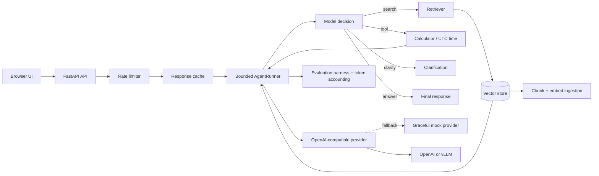

# ContextPilot

A production-minded AI assistant reference implementation for the Applied AI and Engineering AI Systems problem set. It includes an OpenAI-compatible LLM adapter, structured JSON responses, tool calling, RAG ingestion/retrieval, caching, rate limiting, graceful mock fallback, a web UI, tests, Docker, and an optional local vLLM service.

## Quick start

```powershell
python -m venv .venv
.venv\Scripts\Activate.ps1
pip install -r requirements.txt
Copy-Item .env.example .env
uvicorn app.main:app --reload
```

Open http://localhost:8000. The app runs without an API key using a graceful fallback, and still demonstrates document ingestion and source retrieval. For generated answers, set `API_KEY`. For local vLLM, set `BASE_URL=http://localhost:8001/v1`, `MODEL=<served-model>`, and start the optional service with `docker compose --profile local-model up --build`.

## Docker

```powershell
docker compose up --build
```

The local-model profile requires an NVIDIA GPU and a compatible container runtime. The default compose service can use any OpenAI-compatible hosted endpoint.

## API

- `GET /health` reports provider, document count, cache, uptime, and errors.
- `POST /ingest` accepts `{ "title": "...", "content": "..." }` and chunks the document.
- `POST /chat` accepts `{ "message": "...", "use_rag": true }` and returns JSON with answer, sources, tool calls, provider, cache state, and latency.
- OpenAPI docs are at `/docs`.

## W16 Agentify Assignment

### Agentic feature

ContextPilot now uses a single-agent research loop for open-ended questions. A fixed pipeline is insufficient because the agent must inspect intermediate evidence and decide whether to search again, call a tool, ask for clarification, or answer. The loop is bounded by `AGENT_MAX_STEPS` (default `4`) and returns a controlled step-limit response instead of running indefinitely.

### Context engineering technique

The loop uses progressive context capping and history compaction. Retrieval evidence is capped by `AGENT_MAX_CONTEXT_CHARS`, while only the six most recent action/result records are sent back to the model. This solves context growth during repeated searches and keeps the model focused on the latest evidence and remaining decision. The runner also re-ranks naturally by using the vector store's top results and de-duplicates sources before returning them.

### Agentic pattern

This is a single-agent loop. The task needs one coherent evidence state and sequential decisions; multiple agents would add coordination tokens without providing useful specialization or parallelism. The runner keeps the model's decision context isolated from HTTP concerns, while the bounded loop addresses the single-agent failure mode of unbounded exploration.

### Evaluation harness

`scripts/evaluate_agent.py` is a from-scratch harness using scripted model decisions, not an evaluation framework. It measures task completion rate, tool-call correctness, trajectory length, and total prompt/completion tokens. It records failures as hard failures, soft failures, or cascading soft failures. It injects an unavailable-tool failure and a repeated-search step-limit failure; the agent recognizes both instead of inventing a confident result. Run it with `python scripts/evaluate_agent.py`; results are written to [evaluation-results.md](evaluation-results.md) and `evaluation-results.json`.

The capability is implemented as an agent rather than a Skill because a Skill could describe a fixed procedure, but it could not decide dynamically whether the next action should be another retrieval, a tool call, or clarification based on intermediate results.

External services are modeled as bounded tool calls, not agent-to-agent interactions. A calculator or time service has a narrow input/output contract and no independent planning objective, so exposing it through the tool registry keeps the loop observable and limits failure propagation.

## Architecture

Download the standalone architecture sheet: [architecture-diagram.pdf](architecture-diagram.pdf)



## Production notes

The included in-memory vector store uses deterministic hashing embeddings so the sample is self-contained. Replace it with pgvector, Qdrant, or Pinecone and the embedding method with a hosted or sentence-transformer model for production persistence and semantic quality. ONNX conversion is not applied because this project integrates an external generative LLM rather than training a local model; the vLLM path supplies batching, paged attention, and optimized serving instead. For a multi-worker deployment, move rate limits, cache, and vectors to Redis/Postgres/Qdrant.

Run tests with `pytest`.
