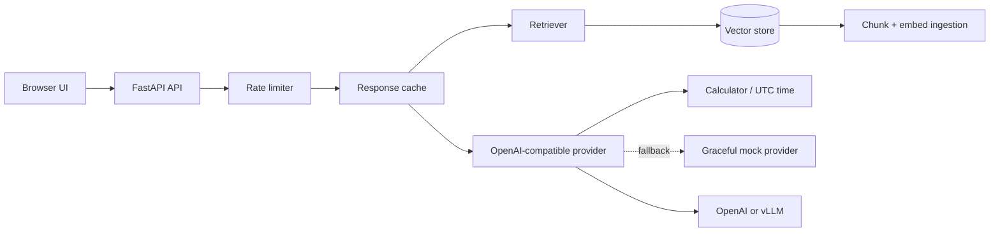

# ContextPilot

A production-minded AI assistant reference implementation for the Applied AI and Engineering AI Systems problem set. It includes an OpenAI-compatible LLM adapter, structured JSON responses, tool calling, RAG ingestion/retrieval, caching, rate limiting, graceful mock fallback, a web UI, tests, Docker, and an optional local vLLM service.

## Quick start

```powershell
python -m venv .venv
.venv\Scripts\Activate.ps1
pip install -r requirements.txt
Copy-Item .env.example .env
uvicorn app.main:app --reload
```

Open http://localhost:8000. The app runs without an API key using a graceful fallback, and still demonstrates document ingestion and source retrieval. For generated answers, set `API_KEY`. For local vLLM, set `BASE_URL=http://localhost:8001/v1`, `MODEL=<served-model>`, and start the optional service with `docker compose --profile local-model up --build`.

## Docker

```powershell
docker compose up --build
```

The local-model profile requires an NVIDIA GPU and a compatible container runtime. The default compose service can use any OpenAI-compatible hosted endpoint.

## API

- `GET /health` reports provider, document count, cache, uptime, and errors.
- `POST /ingest` accepts `{ "title": "...", "content": "..." }` and chunks the document.
- `POST /chat` accepts `{ "message": "...", "use_rag": true }` and returns JSON with answer, sources, tool calls, provider, cache state, and latency.
- OpenAPI docs are at `/docs`.

## Architecture



## Production notes

The included in-memory vector store uses deterministic hashing embeddings so the sample is self-contained. Replace it with pgvector, Qdrant, or Pinecone and the embedding method with a hosted or sentence-transformer model for production persistence and semantic quality. ONNX conversion is not applied because this project integrates an external generative LLM rather than training a local model; the vLLM path supplies batching, paged attention, and optimized serving instead. For a multi-worker deployment, move rate limits, cache, and vectors to Redis/Postgres/Qdrant.

Run tests with `pytest`.
